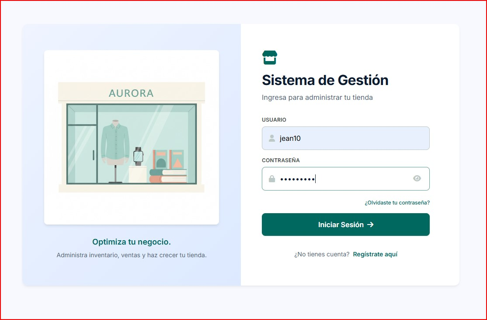
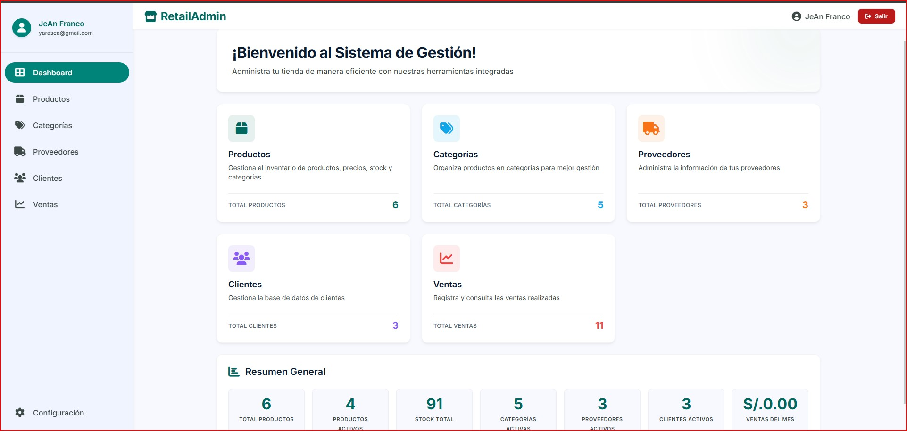
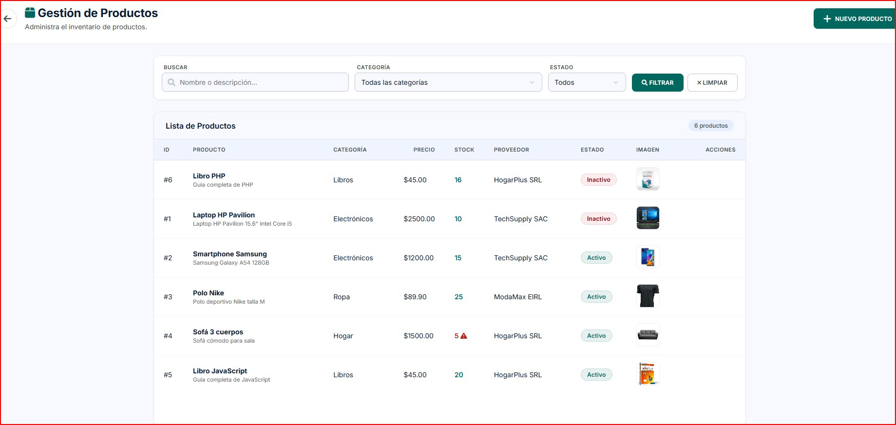
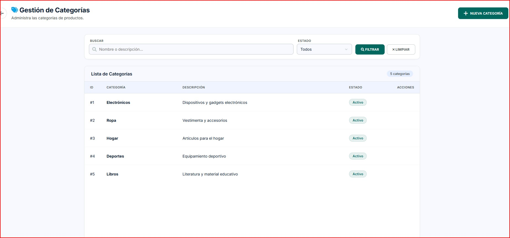
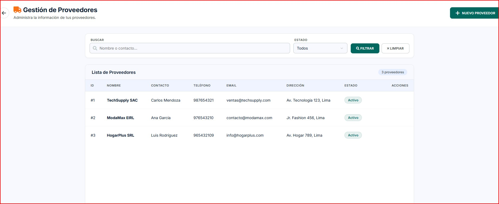
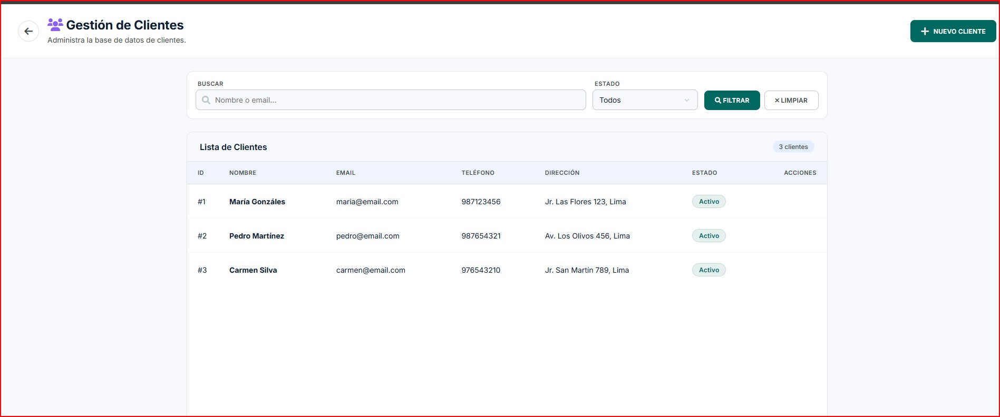
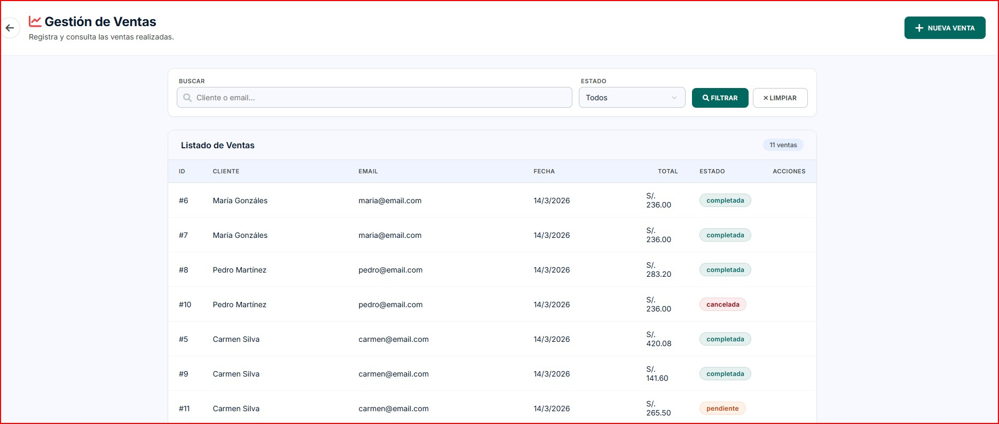

# Sistema de Gestión de Tienda

Sistema web completo para la administración de una tienda, desarrollado como parte de mi formación en Computación e Informática. Incluye módulos para manejar **productos, categorías, clientes, proveedores y ventas**, con autenticación segura mediante **JWT**.

---

## Objetivo

El sistema busca ofrecer una solución práctica y profesional para administrar una tienda, con un enfoque en claridad, modularidad y seguridad. Está diseñado para ser fácil de usar, visualmente atractivo y funcionalmente completo.

---

## Funcionalidades principales

- **Autenticación de usuarios** con registro, inicio de sesión y protección de rutas mediante JWT.
- **Dashboard interactivo** con resumen general, tarjetas informativas y estadísticas en tiempo real.
- **CRUD completo** de productos, categorías, clientes y proveedores con filtros de búsqueda.
- **Gestión de ventas** con registro de detalles (productos, cantidades, precios) y cálculos automáticos.
- **Filtros inteligentes** en todas las tablas: búsqueda por texto y filtrado por estado.
- **Diseño responsive** adaptable a dispositivos móviles y de escritorio.
- **Interfaz moderna** con paleta de colores teal, animaciones suaves y experiencias de usuario pulidas.

---

## Tecnologías utilizadas

### Backend
- **Node.js** — Entorno de ejecución
- **Express 5** — Framework web
- **MySQL** — Base de datos relacional
- **JWT (jsonwebtoken)** — Autenticación por tokens
- **bcrypt** — Encriptación de contraseñas

### Frontend
- **HTML5** — Estructura semántica
- **CSS3** — Diseño visual con Flexbox, Grid y animaciones
- **JavaScript (Vanilla)** — Lógica del lado del cliente
- **Font Awesome** — Iconografía
- **Google Fonts (Inter)** — Tipografía

### Herramientas
- **Git / GitHub** — Control de versiones
- **Postman** — Pruebas de API

---

## Estructura del proyecto

`
tiendaApp/
├── backend/
│   ├── config/          # Conexión a la base de datos
│   ├── controllers/     # Lógica de negocio (auth, productos, etc.)
│   ├── middleware/       # Middleware de autenticación JWT
│   └── routes/          # Definición de rutas API
├── frontend/
│   ├── css/             # Estilos del sistema
│   ├── js/              # Lógica del frontend
│   └── pages/           # Páginas de gestión (CRUD)
├── docs/images/         # Capturas de pantalla
├── database.sql         # Esquema y datos de la base de datos
└── README.md
`

---

## Instalación y configuración

### 1. Clonar el repositorio

`ash
git clone https://github.com/tu-usuario/tiendaApp.git
cd tiendaApp
`

### 2. Configurar la base de datos

1. Crear una base de datos MySQL llamada 	iendita_db.
2. Importar el archivo database.sql:

`ash
mysql -u root -p tiendita_db < database.sql
`

### 3. Configurar el backend

`ash
cd backend
npm install
`

Crear un archivo .env en la carpeta ackend/ con las siguientes variables:

`
DB_HOST=localhost
DB_USER=root
DB_PASSWORD=tu_contraseña
DB_NAME=tiendita_db
JWT_SECRET=MiClaveSecretaDePractica
PORT=3000
`

Iniciar el servidor:

`ash
node server.js
`

El backend se ejecutará en http://localhost:3000.

### 4. Ejecutar el frontend

El frontend es estático. Simplemente abre rontend/index.html en tu navegador o usa un servidor local como Live Server de VS Code.

### 5. Credenciales de prueba

| Usuario | Contraseña |
|---------|-----------|
| admin   | admin123  | 
O crear por registro usuario para entrar como admin

---

## API Endpoints

### Autenticación

| Método | Ruta                | Descripción            | Autenticación |
|--------|---------------------|------------------------|---------------|
| POST   | /api/auth/login   | Iniciar sesión         | No            |
| POST   | /api/auth/register| Registrar nuevo usuario| No            |
| GET    | /api/auth/verify  | Verificar token JWT    | Sí            |

### Módulos (requieren JWT)

| Método | Ruta                     | Descripción               |
|--------|--------------------------|---------------------------|
| GET    | /api/productos         | Listar productos          |
| POST   | /api/productos         | Crear producto            |
| PUT    | /api/productos/:id     | Actualizar producto       |
| DELETE | /api/productos/:id     | Eliminar producto         |
| GET    | /api/categorias        | Listar categorías         |
| POST   | /api/categorias        | Crear categoría           |
| PUT    | /api/categorias/:id    | Actualizar categoría      |
| DELETE | /api/categorias/:id    | Eliminar categoría        |
| GET    | /api/clientes          | Listar clientes           |
| POST   | /api/clientes          | Crear cliente             |
| PUT    | /api/clientes/:id      | Actualizar cliente        |
| DELETE | /api/clientes/:id      | Eliminar cliente          |
| GET    | /api/proveedores       | Listar proveedores        |
| POST   | /api/proveedores       | Crear proveedor           |
| PUT    | /api/proveedores/:id   | Actualizar proveedor      |
| DELETE | /api/proveedores/:id   | Eliminar proveedor        |
| GET    | /api/ventas            | Listar ventas             |
| POST   | /api/ventas            | Registrar venta           |
| GET    | /api/ventas/:id        | Ver venta con detalles    |

---

## Capturas de pantalla

### Inicio de sesión

### Dashboard

### Productos con filtros

### Categorías con filtros

### Proveedores con filtros

### Clientes con filtros

### Ventas y detalles de venta

---

## Nota

Este proyecto forma parte de mi portafolio personal y está documentado para mostrar mis habilidades en desarrollo full stack. Si tienes preguntas o sugerencias, no dudes en contactarme.

---

**Desarrollado con dedicación** — Proyecto de formación en Computación e Informática.
